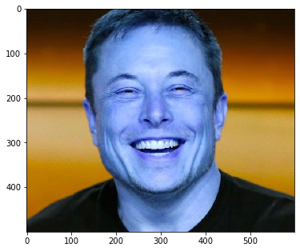
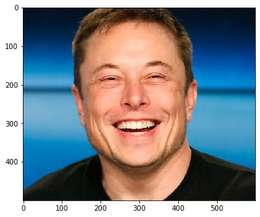
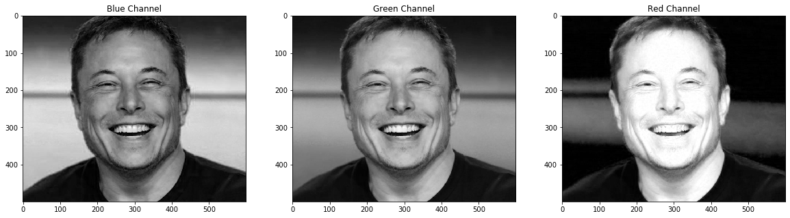
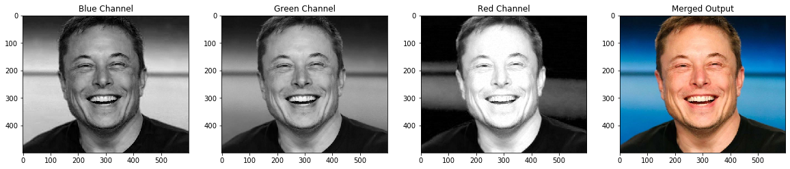
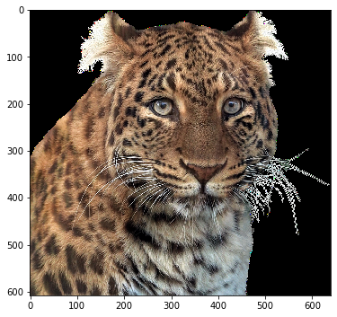
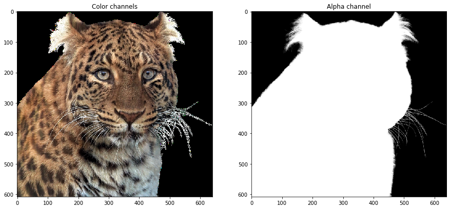

# Images

## Import Libraries and Setup Workspace
---

```
import cv2
import numpy as np
import matplotlib.pyplot as plt
%matplotlib inline

import matplotlib
matplotlib.rcParams['figure.figsize'] = (6.0, 6.0)
matplotlib.rcParams['image.cmap'] = 'gray'

```

<br>

## Reading an Image
---
```
retval = cv2.imread( filename [, flags] )
```

 **Note:** 
 `retval` is the image if it is successfully loaded. Otherwise it is `None`. This may happen if the filename is wrong or the file is corrupt.

### `imread` Flags
- `cv2.IMREAD_GRAYSCALE || 0`: Loads image in grayscale mode
- `cv2.IMREAD_COLOR || 1`: Loads a color image. Any transparency of image will be neglected. It is the default flag.
- `cv2.IMREAD_UNCHANGED || -1`: Loads image as such including alpha channel.

### Properties of an Image
```
print("Data type = {}\n".format(testImage.dtype))
print("Object type = {}\n".format(type(testImage)))
print("Image Dimensions = {}\n".format(testImage.shape))
```

#### Output
	Data type = uint8 # data type of array/matix (multiple dimensions / image) value is an unsigned int and the depth is 8 bit (0-255)
	Object type = <class 'numpy.ndarray'>
	Image Dimensions = (height, width)

**Note:**
==It should be kept in mind that in *Opencv*, size is represented as `width x height`, but in *numpy* size is represented as `height x width`==

<br> 


## Displaying an Image
---

### Display Image
```
None = plt.imshow(image)
```


### Show Color Bar Along with Displaying the Image
```
plt.imshow(image)
plt.colorBar()
```

**Note:** ==The form of a color image is not originally in ***rgb*** format rather its in ***bgr*** format.== 

### Converting *BGR* Image to *RGB*
#### Way 1:

```
image = cv2.imread(filename, cv2.IMREAD_COLOR)
image_rgb = cv2.cvtColor(image, cv2.COLOR_BGR2RGB)
plt.imshow(image_rgb)
```

#### Way 2: 
 We can also use the following syntax, it will reverse the order of the 3rd dimension i.e. channels
```
plt.imshow(img[:,:,::-1])
```



<br> 

## Writing to Disk
---

```retval = cv2.imwrite( filename, img [, params] )```

 **Note:** 
 `retval` returns a boolean value regarding if the image was written to disk successfully. 
 
### `imwrite` Flags
- `filename` - String providing the relative or absolute path where the image should be saved.
- `img` - Image matrix to be saved.
- `params` - Additional information, like specifying the JPEG compression quality etc. Check the full list [here](https://docs.opencv.org/4.1.0/d4/da8/group__imgcodecs.html#ga292d81be8d76901bff7988d18d2b42ac)

<br>

## Splitting and Merging Channels
----

### Splitting Channels

#### Way 1:
```
# Show the channels
plt.figure(figsize=[20,5])

plt.subplot(131); plt.imshow(img[:,:,0]); plt.title("Blue Channel");
plt.subplot(132); plt.imshow(img[:,:,1]); plt.title("Green Channel");
plt.subplot(133); plt.imshow(img[:,:,2]); plt.title("Red Channel");
```
**Note:** ==plt.subplot param (one 3 digit arg, or three 1 digit args) => numRows, numCols, indexOfSubplot== 

#### Way 2:
```
# Split the image into the B,G,R components
b,g,r = cv2.split(img)

# Show the channels
plt.figure(figsize=[20,5])
plt.subplot(141); plt.imshow(b); plt.title("Blue Channel");
plt.subplot(142); plt.imshow(g); plt.title("Green Channel");
plt.subplot(143); plt.imshow(r); plt.title("Red Channel");

# Merge the individual channels into a BGR image
imgMerged = cv2.merge((b,g,r))

# Show the merged output
plt.subplot(144);plt.imshow(imgMerged[:,:,::-1]);plt.title("Merged Output");
```


### Merging Channels

```# Split the image into the B,G,R components
b,g,r = cv2.split(img)


# Merge the individual channels into a BGR image
imgMerged = cv2.merge((b,g,r))

# Show the merged output
plt.subplot(144);plt.imshow(imgMerged[:,:,::-1]);plt.title("Merged Output");
```




<br>

## Manipulating Pixels
---
### Manipulating a Grey Scale image
**Note:** ==data type of np.array / matrix are single values (0-255)==
#### Manipulating a Single Pixel
```
image[0,0]=200
```

#### Manipulating Multiple Pixels
```
image[0:2,0:4] = 111
```
**Note:** `[row, column]`

#### Slicing Syntax
```
[start: stop: step]
```

### Manipulating Color Pixels
**Note:** ==data type of np.array / matrix are tuples containing three values (0-255); Tuple format ***(blue, green, red)***==
#### Common Color knowledge: 
- Yellow ( It is a mixture of Red and Green )
- Cyan ( It is a mixture of Blue and Green )
- Magenta ( It is a mixture of Blue and Red )

#### Modifying a Single Pixel
```
testImage[0,0] = (0,255,255) # make pixel yellow (b, g, r)
```

<br>

## Images With Alpha Channel
In images with an alpha channel, each pixel not only has a color value, but also has a numerical transparency value ( between 0 to 255) that defines what will happen when the pixel is placed over another pixel.

There are 4 channels, i.e. 3 color channels and 1 alpha channel which indicates the transparency.

 The alpha mask is basically a very accurate segmentation of the image. It is useful for creating overlays ( Augmented Reality type of applications ). If you don't have tha alpha mask, then you have to separate out the whiskers from the white background ( see original image above ) which can be very difficult.

```
# Path of the PNG image to be loaded
imagePath = os.path.join(DATA_PATH,"images/panther.png")

# Read the image
# Note that we are passing flag = -1 while reading the image ( it will read the image as is)
imgPNG = cv2.imread(imagePath,-1)
imgRGB = cv2.cvtColor(imgPNG,cv2.COLOR_BGR2RGB)
plt.imshow(imgRGB)
print("image Dimension ={}".format(imgPNG.shape))
```




```
#First 3 channels will be combined to form BGR image
#Mask is the alpha channel of the original image
imgBGR = imgPNG[:,:,0:3]
imgMask = imgPNG[:,:,3]
plt.figure(figsize=[15,15])
plt.subplot(121);plt.imshow(imgBGR[:,:,::-1]);plt.title('Color channels');
plt.subplot(122);plt.imshow(imgMask,cmap='gray');plt.title('Alpha channel');
```



