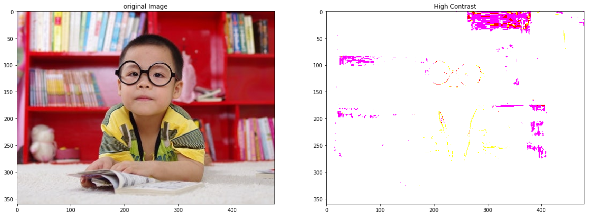
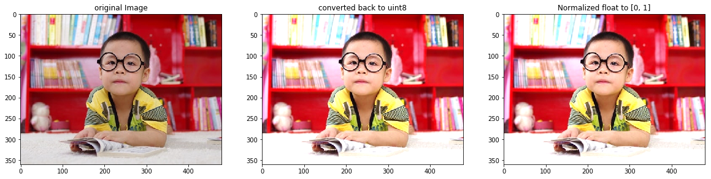
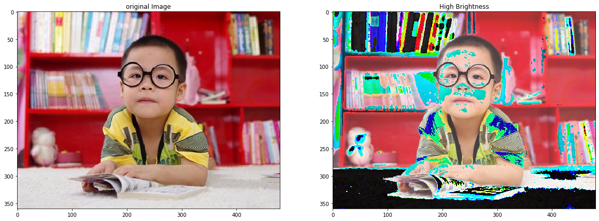
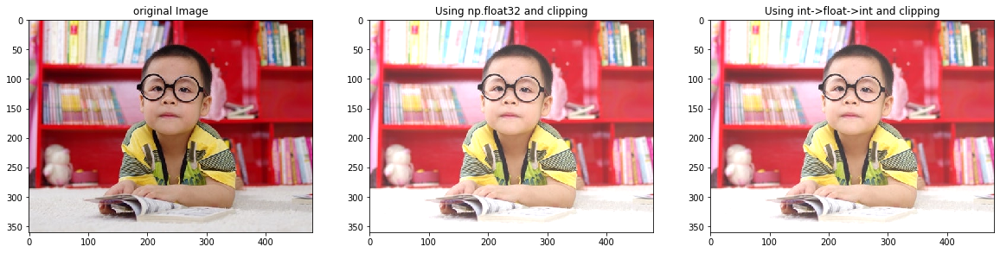

# Mathematical operations on images
## Datatype conversion
 For most Arithmetic operations like multiplication or division, we need to convert the array type to floating point with each pixel having 16, 32 or 64 bits of data, meaning each color channel could have 2^n possibilities of value. This helps prevent overflow while working with the images.

Most of the time we don't need to work using float64 and float32 is enough for most image processing operations ( even float16 ).

Once we convert an image from a uint8 to a float32 data type we need to scale the values of the image accordingly. 
- The scale or the scaling factor reduces the range of 0-255 to 0-1, hence all the floating point numbers now range between 0-1. 
- When we convert back to unsigned integer we use the reciprocal of the scaling factor and the range is converted from 0-1 to 0-255.

```
# Read image
image = cv2.imread(os.path.join(DATA_PATH,"images/boy.jpg"))

scalingFactor = 1/255.0

# Convert unsigned int to float
image = np.float32(image)
# Scale the values so that they lie between [0,1]
image = image * scalingFactor

#Convert back to unsigned int
image = image * (1.0/scalingFactor)
image = np.uint8(image)
```

## Contrast Enhancement
**Contrast** is approximately the difference in intensity between the brightest and darkest regions of a given image. The higher the difference, the higher the contrast. 

The maximum contrast of an image is also known as **Dynamic Range**. 

One of the easiest ways to improve contrast of an image is Intensity Scaling:

`updatedIntesityImage = alpha * originalIntensityimage`

```
contrastPercentage = 20

# Multiply with scaling factor to increase contrast
contrastHigh = image * (1+contrastPercentage/100)

# Display the outputs
plt.figure(figsize=[20,20])
plt.subplot(121);plt.imshow(image[...,::-1]);plt.title("original Image");
plt.subplot(122);plt.imshow(contrastHigh[...,::-1]);plt.title("High Contrast");
```

**Note:**
We will have an error due to the maximum value of a uint8 data type image being 255 and some of the pixel intensities were brought to a higher value than that with the mathematical operation. We are overflowing and loosing information, overflowing means the value holder has hit the end of the range of possible values and rolled over back to zero.



### Solutions is to normalize intensity values 
1. Clip or Normalize the intensity values to 0 ~ 255 and change the data type to uint8.
2. If you want to keep the image in float format, then Normalize the intensity values so that it lies in [0,1].

```
contrastPercentage = 30

# Clip the values to [0,255] and change it back to uint8 for display
contrastImage = image * (1+contrastPercentage/100)
clippedContrastImage = np.clip(contrastImage, 0, 255)
contrastHighClippedUint8 = np.uint8(clippedContrastImage)

# Convert the range to [0,1] and keep it in float format
contrastHighFloat = image * (1+contrastPercentage/100.0)
maxValue = image.max()
contrastHighNormalized01 = contrastHighFloat/maxValue

plt.figure(figsize=[20,20])
plt.subplot(131);plt.imshow(image[...,::-1]);plt.title("original Image");
plt.subplot(132);plt.imshow(contrastHighClippedUint8[...,::-1]);plt.title("converted back to uint8");
plt.subplot(133);plt.imshow(contrastHighNormalized01[...,::-1]);plt.title("Normalized float to [0, 1]");

```

#### `np.clip` Parameters:
- Image/array 
- low bound
- high bound



### Brightness Enhancement
**Brightness** is a measure of light falling on the scene.
In RGB color space, it can be thought of as the arithmetic mean of the R, G and B color values. To make an image brighter or darker, the intensity values should offset by a constant.
`updateBrightnessImage = originalBrightnessImage + someConstant`

**Note:**
One thing we need to be careful of when we do any mathematical operation is to make sure we are not overflowing due to uint8's nature of only holding 0 to 255 values.

For example: 
```
# Sample 2x2 matrix of type uint8
a = np.array([[100, 110], 
              [120, 130]], dtype='uint8')

# Add 130 so that the last element encounters overflow
print(a + 130)
```
Output will be: 
```
# Output
[[230 240]
 [250   4]]
```

Notice how the last element in the second row has been overflowed. 
This is what the image will look like with overflow:




#### Solutions
1. Use a different syntax when doing operations, wrap the constant in parentheses.

```
# Sample 2x2 matrix of type uint8
a = np.array([[100, 110], 
              [120, 130]], dtype='uint8')

print(a + (-130))

```

In this solution the 2nd operand has a type int16. Thus, the final output becomes int16, with this being said we still need to clip and or normalize the values before displaying the new image.
 
 2. Use open cv's add function which will automatically clip the values
```print(cv2.add(a,130))```
Output
```
# Output
[[230 240]
 [250 255]]
```
 
3. Convert to int32/int64

You can convert to higher integer types to avoid overflow and underflow situations. 
Perform clipping and or normalize if necessary and bring it back to uint8 in the final stage as that is what the display functions expect.
```
a_int32 = np.int32(a)
b = a_int32+130

# clip image and convert back to uint8
b_uint8 = np.uint8(b.clip(0,255))
b_uint8

```

4. Convert to normalized float32/float64

```
a_float32 = np.float32(a)/255
b = a_float32 + 130/255

# convert back to range of 0 and 255
c = b*255
print("Output = \n{}".format(c))
print("Clipped output= \n{}".format(c.clip(0,255)))

# convert back to range of 0 and 255 and also convert back to uint8
b_uint8 = np.uint8(c.clip(0,255))
print("uint8 output = \n{}".format(b_uint8))
```

5. Utilize `np.ones` function along with open cv's `cv.add` function
```
brightnessOffset = 50

# Add the offset for increasing brightness
brightHighOpenCV = cv2.add(image, np.ones(image.shape,dtype='uint8')*brightnessOffset)

# Display image
plt.subplot(111)
plt.imshow(brightHighOpenCV[...,::-1])
plt.title("Using cv2.add function");

```

6. Use numpy and clipping 
```
brightnessOffset = 50
brightHighInt32 = np.int32(image) + brightnessOffset
brightHighInt32Clipped = np.clip(brightHighInt32,0,255)

plt.subplot(111)
plt.imshow(brightHighInt32Clipped[...,::-1])
plt.title("Using numpy and clipping");
```

7. Alternative numpy and clipping  approach
```
# Add the offset for increasing brightness
brightHighFloat32 = np.float32(image) + brightnessOffset
brightHighFloat32NormalizedClipped = np.clip(brightHighFloat32/255,0,1)

brightHighFloat32ClippedUint8 = np.uint8(brightHighFloat32NormalizedClipped*255)

# Display the outputs
plt.figure(figsize=[20,20])
plt.subplot(131);plt.imshow(image[...,::-1]);plt.title("original Image");
plt.subplot(132);plt.imshow(brightHighFloat32NormalizedClipped[...,::-1]);plt.title("Using np.float32 and clipping");
plt.subplot(133);plt.imshow(brightHighFloat32ClippedUint8[...,::-1]);plt.title("Using int->float->int and clipping");
```

